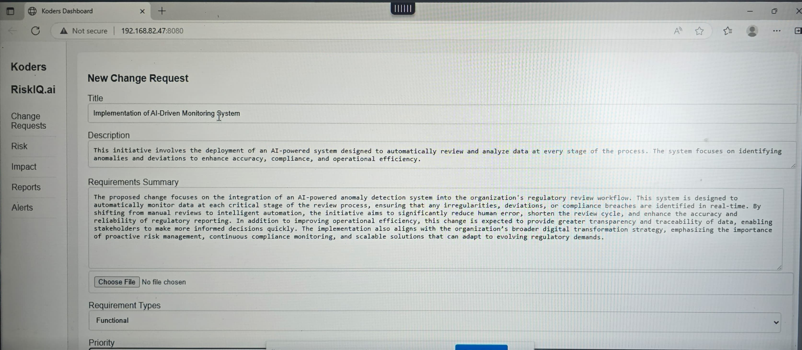
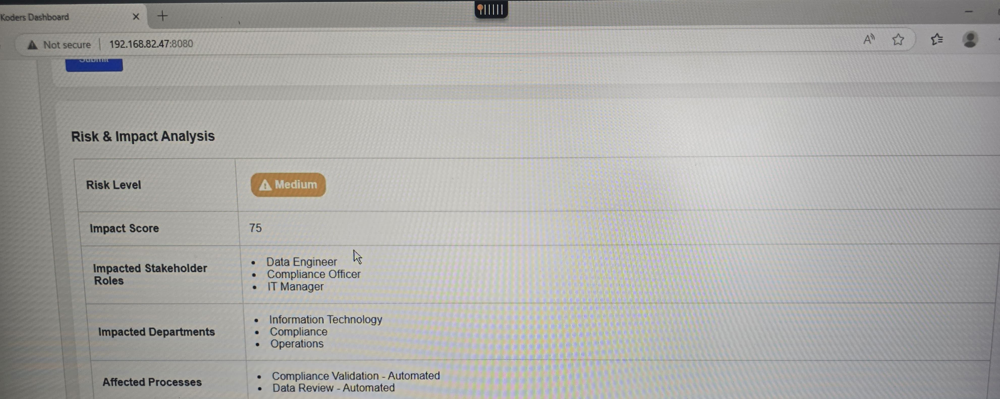
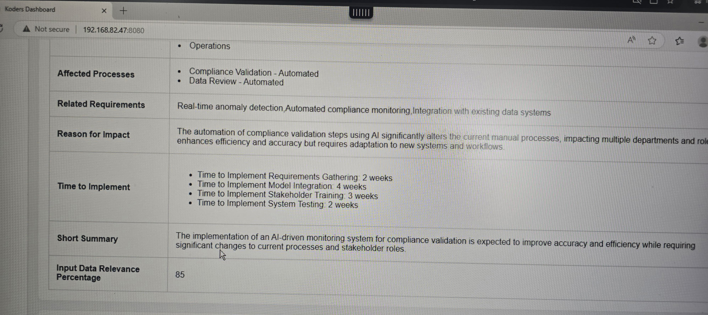
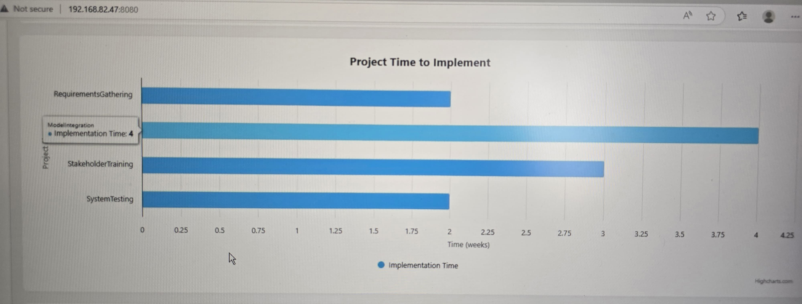
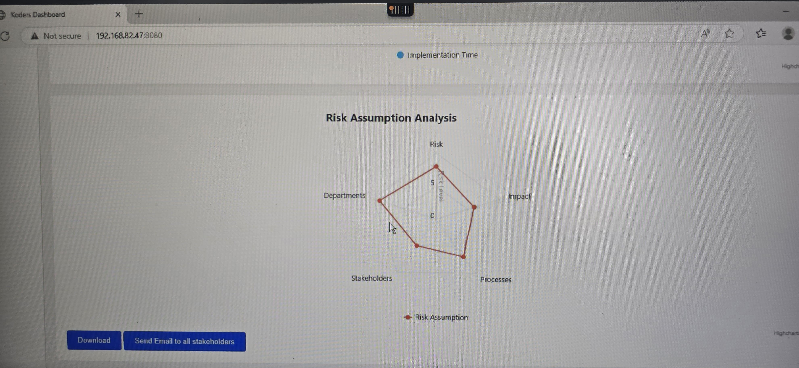

### Architecture
The AI-Powered Change Impact Analyzer is designed using a robust, scalable pipeline combining Azure services, OpenAI models, and modern frameworks like LangChain and Flask. Below is a step-by-step breakdown of the architecture:

#### 1. Data Ingestion – `Databricks`
- **Purpose:** Ingest and preprocess test data from five structured sources:
  - `processes.xlsx`
  - `stakeholders.xlsx`
  - `requirements.xlsx`
  - `reports.xlsx`
  - `change_impact.xlsx`
- **Tool:** Databricks is used for cleansing, transforming, and preparing data for downstream embedding generation.

#### 2. Chunking – `LangChain`
- **Purpose:** Converts preprocessed data into smaller, semantically meaningful text chunks.
- **Tool:** LangChain enables efficient chunking to prepare for embedding.

#### 3. Embedding Generation – `OpenAI (text-embedding-3-large)`
- **Purpose:** Generates high-dimensional vector representations (embeddings) for each data chunk.
- **Model:** OpenAI's `text-embedding-3-large` is used for semantic understanding of the content.

#### 4. Storage – `Azure Cognitive Services`
- **Purpose:** Stores embeddings and enables fast similarity-based retrieval.
- **Tool:** Azure Cognitive Search (part of Azure Cognitive Services) is used for vector indexing and storage.

####  5. Retrieval – `LangChain + Azure`
- **Purpose:** Retrieves the most relevant chunks of information based on user query.
- **Process:** LangChain retrieves vectors from Azure using semantic similarity search.

####  6. Backend Integration – `Flask API`
- **Purpose:** Acts as the backend engine to manage the flow between user queries, LangChain logic, and OpenAI processing.
- **Tool:** Flask is used to serve the API endpoints and manage stateful interactions.

#### 7. User Interface (UI)
- **Purpose:** Provides a front-end interface for users to submit queries or change requests.
- **Function:** Sends user inputs to the Flask API and displays AI-generated insights.

#### 8. AI Reasoning – `GPT-4o`
- **Purpose:** Combines user queries with retrieved context to generate detailed impact analysis.
- **Tool:** Azure OpenAI provides access to GPT-4o for reasoning and response generation.

#### 9. Automation – `Power Automate`
- **Purpose:** Automatically triggers workflows, such as notifying impacted stakeholders.
- **Tool:** Power Automate integrates with the backend to send emails or alerts based on analysis.

#### 10. Communication – `Stakeholder Email Notifications`
- **Purpose:** Final step in the workflow to ensure relevant stakeholders are informed in real-time.
- **Outcome:** Helps teams take timely action based on impact insights generated by the system.

> This architecture enables real-time, AI-driven change impact analysis, improving accuracy, speed, and stakeholder alignment.

---
### Sample Input
This detailed submission is used to test how well the system can:

- Extract impacted entities (stakeholders, processes, departments)

- Analyze associated risk level and impact score

- Suggest downstream actions like stakeholder alerts

This use case exemplifies a high-value enterprise change, perfect for validating the analyzer’s real-world application.

---
### Sample Output

Once a change request is submitted, the system processes the input and generates a comprehensive analysis. Below is an explanation of the sample output produced for the change titled **"Implementation of AI-Driven Monitoring System"**.

#### 1. Affected Processes

- `Compliance Validation – Automated`
- `Data Review – Automated`

These processes are directly impacted due to the shift from manual validation to intelligent automation, requiring updates in workflows and supporting systems.

#### 2. Related Requirements
- `Real-time anomaly detection`
- `Automated compliance monitoring`
- `Integration with existing data systems`

These requirements were semantically matched from the test data using embeddings and reflect the core functionalities needed for the proposed change.

#### 3. Reason for Impact
> The automation of compliance validation steps using AI significantly alters the current manual processes, impacting multiple departments and roles. It enhances efficiency and accuracy but requires adaptation to new systems and workflows.

This is an AI-generated justification that contextualizes why and how the change introduces operational impact.

#### 4. Time to Implement
- **Requirements Gathering:** 2 weeks  
- **Model Integration:** 4 weeks  
- **Stakeholder Training:** 3 weeks  
- **System Testing:** 2 weeks  

These estimates help project managers plan the timeline and dependencies associated with implementing the proposed change.

#### 5. Short Summary
> The implementation of an AI-driven monitoring system for compliance validation is expected to improve accuracy and efficiency while requiring significant changes to current processes and stakeholder roles.

This one-line summary gives stakeholders a quick, meaningful overview of the proposed change’s implications.

#### 6. Input Data Relevance Percentage
- **85%**

Indicates how well the AI-matched data aligns with the submitted change request. A high percentage means the retrieved data is highly relevant and reliable for impact analysis.

> This output equips teams with the critical insights needed for faster approvals, stakeholder awareness, and automation readiness.
 ---

#### Images

 
---

---
 
---

---